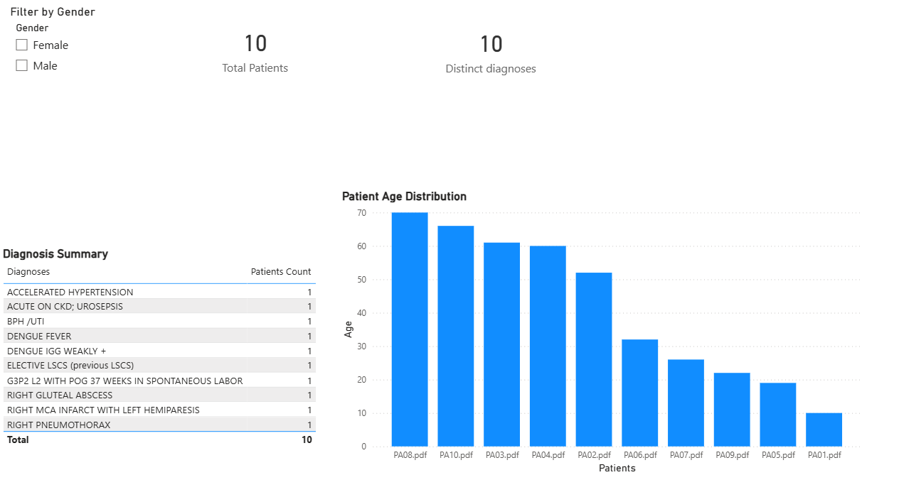
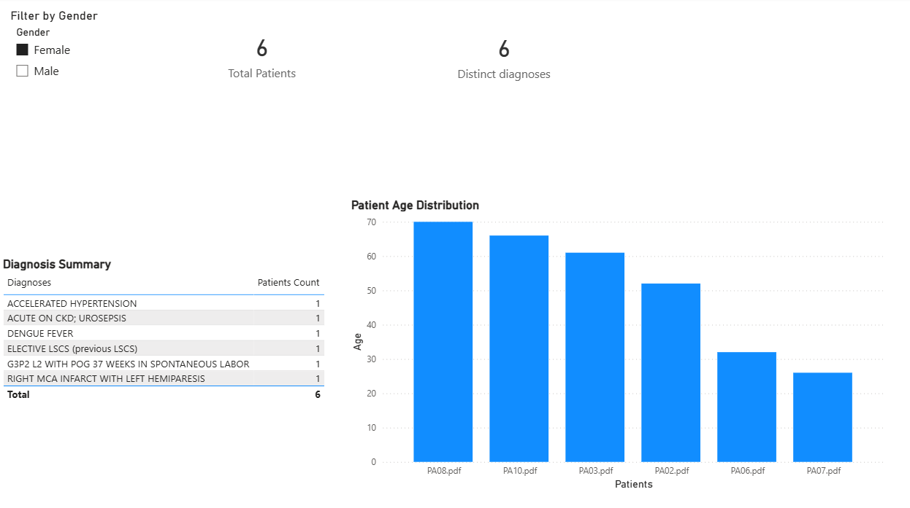
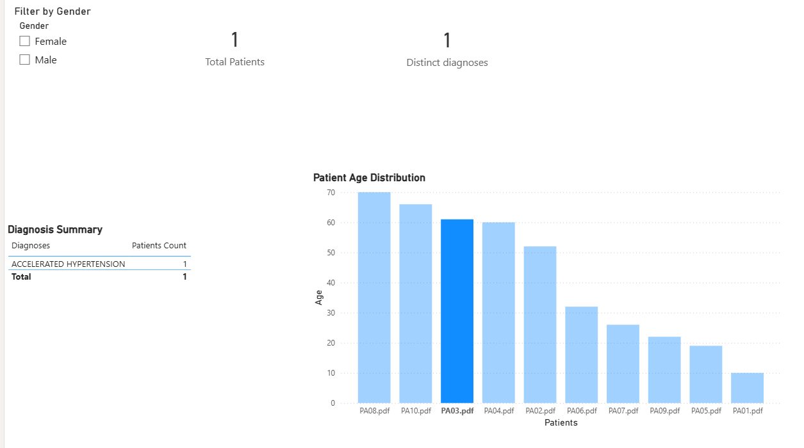

# Clinical NLP and LLM Pipeline for Structured Extraction from Hospital Discharge Summaries

## Overview

Healthcare systems generate large volumes of unstructured clinical documents such as discharge summaries. Extracting structured information from these documents is essential for analytics, research, and decision support.

This project builds an **end-to-end NLP pipeline** that converts **unstructured discharge summary PDFs into structured clinical datasets** using rule-based extraction and Large Language Model (LLM) techniques.

The resulting structured dataset can be used for **healthcare analytics, dashboards, and downstream machine learning applications**.

---

## Objective

The goal of this project is to transform **unstructured hospital discharge summaries into structured machine-readable data**.

The pipeline extracts the following clinical attributes:

- Patient Age
- Gender
- Final Diagnosis
- Symptoms
- Medications
- Procedures

Missing values are standardized as **"Not available"** to ensure dataset consistency.

---

## Dataset Source

This project uses a **preview subset of the Healthcare Discharge Summary Dataset available on Kaggle**.

Dataset link:  
https://www.kaggle.com/datasets/infobayai/healthcare-discharge-summary

The dataset contains hospital discharge summary reports that include clinical information such as:

- patient demographics
- diagnosis
- symptoms
- medications
- procedures

The dataset is provided as a **sample dataset for experimentation and pipeline validation**.

### Data Access

The dataset is **not included in this repository due to licensing restrictions**.

To reproduce this project:

1. Download the dataset from Kaggle.
2. Place the discharge summary PDF files inside the `data/` folder.
3. Run the notebook pipeline.

---

## Project Workflow

The pipeline converts unstructured clinical documents into structured datasets through the following stages:

```
PDF Discharge Summaries
        ↓
Text Extraction (pdfplumber)
        ↓
Rule-Based NLP Extraction
        ↓
LLM-Based Structured Extraction
        ↓
Structured Clinical Dataset (CSV / JSON)
        ↓
Power BI Analytics Dashboard
```
## Architecture

This project follows a modular architecture for processing clinical discharge summaries.

### Components

**Document Processing Layer**
- Extracts raw text from PDF discharge summaries using `pdfplumber`.

**NLP Extraction Layer**
- Rule-based NLP methods identify clinical attributes such as age, gender, diagnosis, symptoms, medications, and procedures.

**LLM Extraction Layer**
- Large Language Models convert unstructured clinical narratives into structured JSON outputs for improved contextual understanding.

**Data Storage Layer**
- Extracted clinical attributes are stored as structured CSV and JSON datasets.

**Analytics Layer**
- A Power BI dashboard visualizes patient demographics, diagnoses, and age distribution.

**Validation Layer**
- GitHub Actions CI pipeline validates dependencies and repository structure automatically.

---

## Technologies Used

- Python
- Jupyter Notebook
- Pandas
- pdfplumber
- Regular Expressions (Regex)
- spaCy (NLP)
- Large Language Models (LLM)
- Power BI
- GitHub Actions (CI/CD)

---

## NLP Extraction Fields

The rule-based NLP pipeline extracts key clinical attributes from discharge summaries using text processing and regular expressions.

Extracted fields include:

- **Patient Age** – extracted from demographic information.
- **Gender** – identified from the "Age / Sex" section.
- **Final Diagnosis** – extracted from the "FINAL DIAGNOSIS" section.
- **Symptoms** – identified from clinical complaint descriptions.
- **Medications** – extracted from discharge medication sections.
- **Procedures** – extracted from surgery or procedure sections.

These fields are stored in a structured dataframe and exported as a dataset for analysis.

---

## LLM-Based Structured Output

In addition to rule-based extraction, the pipeline includes an **LLM-based information extraction layer**.

The Large Language Model processes the discharge summary and returns structured JSON output containing clinical attributes.

Example output:

```json
{
  "patient_age": "52",
  "gender": "Female",
  "diagnosis": "Dengue Fever",
  "symptoms": ["fever", "body ache", "nausea"],
  "medications": ["Paracetamol", "Levocetirizine"],
  "procedures": ["Not available"]
}
 ```
The LLM-based approach demonstrates improved flexibility in handling variations in clinical text and document formatting.

### Results

Two extraction approaches were implemented and compared:

### Method	Description
Rule-Based NLP	Uses regex patterns and structured text parsing
LLM-Based Extraction	Uses language models to interpret clinical context

The LLM-based approach produced more accurate and complete extraction results, especially for symptoms, medications, and procedures.

## Dashboard

The structured dataset generated by the NLP and LLM pipeline is visualized using a Power BI dashboard to support clinical data exploration and analysis.

The dashboard provides the following insights:

- Total number of processed discharge summaries
- Distinct clinical diagnoses identified in the dataset
- Diagnosis summary table showing extracted clinical conditions
- Patient age distribution across records
- Interactive filtering by gender and diagnosis

The dashboard enables quick exploration of structured clinical information extracted from unstructured discharge summaries.

### Dashboard Preview



### Gender Filter Example



### Diagnosis Filter Example


## CI/CD Pipeline

A GitHub Actions CI/CD workflow is included to ensure project reliability.

The automated pipeline performs:

1. Dependency installation from requirements.txt

2. Python environment validation

3. Pipeline dependency checks

4. Automated validation of required libraries

This ensures that the project remains reproducible and functional across environments.

## Future Architecture

Future Architecture

While this project currently demonstrates a local end-to-end workflow for extracting structured clinical information from hospital discharge summaries, the system can be extended into a scalable healthcare document processing architecture suitable for real-world clinical analytics environments.

```
Clinical PDF Documents
        ↓
Cloud Storage / Data Lake
        ↓
Distributed Document Ingestion
        ↓
PDF Text Extraction Service
        ↓
Rule-Based NLP + LLM Extraction Pipeline
        ↓
Structured Clinical Data Store
        ↓
Analytics Dashboards / API Access
        ↓
Containerized Deployment and Monitoring
```
### Proposed Future Enhancements

#### Cloud Storage

Store discharge summaries in scalable storage platforms such as AWS S3, Azure Blob Storage, or Google Cloud Storage, enabling secure and reliable document ingestion.

#### Distributed Processing

Use distributed frameworks such as Databricks or Apache Spark to process large volumes of clinical documents efficiently.

#### LLM Extraction Services

Deploy LLM-based extraction pipelines as reusable services that convert unstructured clinical narratives into structured datasets.

#### Structured Data Storage

Store extracted clinical attributes in scalable formats such as Parquet, Delta Tables, or relational databases to support analytics and machine learning workflows.

#### Containerized Deployment

Package the pipeline using Docker containers and orchestrate processing workloads using Kubernetes.

#### API Layer

Provide REST APIs that allow healthcare systems or research tools to submit discharge summaries and retrieve structured clinical outputs.

#### Monitoring and CI/CD

Extend the current GitHub Actions CI pipeline to support automated testing, deployment validation, monitoring, and workflow reliability.

## Future Improvements

Potential future enhancements for this project include:

1. **Clinical Named Entity Recognition (NER)**  
   Implement advanced NER models to automatically identify diseases, medications, procedures, and clinical entities from discharge summaries.

2. **Automated Diagnosis Classification**  
   Train machine learning models to classify patient diagnoses and clinical conditions using extracted textual features.

3. **Integration with Electronic Health Record (EHR) Systems**  
   Connect the pipeline with structured EHR datasets to enable richer clinical analysis and decision support.

4. **Scalable Data Processing using Databricks or Apache Spark**  
   Extend the pipeline to process large-scale clinical document collections using distributed data processing frameworks.

5. **Containerized Deployment using Docker and Kubernetes**  
   Package the NLP and LLM extraction pipeline as containerized services for scalable deployment.

6. **Real-Time Clinical Document Processing APIs**  
   Develop APIs that allow healthcare systems to submit discharge summaries and receive structured clinical outputs in real time.

## Project Structure

```
clinical-nlp-llm-discharge-summary/
│
├── clinical_nlp_llm_pipeline.ipynb
├── outputs/
│   ├── structured_discharge_dataset.csv
│   └── sample_llm_output.json
├── dashboard/
│   ├── dashboard_overview.png
│   ├── gender_filter_view.png
│   └── diagnosis_filter_view.png
├── .github/
│   └── workflows/
│       └── ci.yml
├── README.md
├── requirements.txt
└── .gitignore
```

## How to Run
### 1. Clone the Repository

```
git clone https://github.com/RameswariMishra/clinical-nlp-llm-discharge-summary
cd clinical-nlp-llm-discharge-summary
```
### 2. Install Requirements Document
```
pip install -r requirements.txt
```

### 3. Configure LLM API Key (Optional)

To run the LLM-based extraction section, create an API key and store it as an environment variable.

Example using a .env file:

```
OPENAI_API_KEY=your_api_key_here
```

### 4. Download the dataset
Download the discharge summary dataset from Kaggle and place the PDF files inside: data/

### 5. Run the notebook
notebooks/clinical_nlp_llm_pipeline.ipynb

## Conclusion

This project demonstrates how Natural Language Processing and Large Language Models can convert unstructured clinical discharge summaries into structured datasets.

By combining PDF text extraction, rule-based NLP, LLM-based structured extraction, and Power BI visualization, the pipeline transforms clinical narratives into analytics-ready healthcare data.

Such approaches can support healthcare analytics, clinical research, and intelligent decision-support systems by enabling scalable processing of unstructured medical documents.

Additionally, the project incorporates a GitHub Actions CI pipeline to validate dependencies and ensure reproducibility of the workflow across environments.

## Author
Created by Rameswari Mishra
